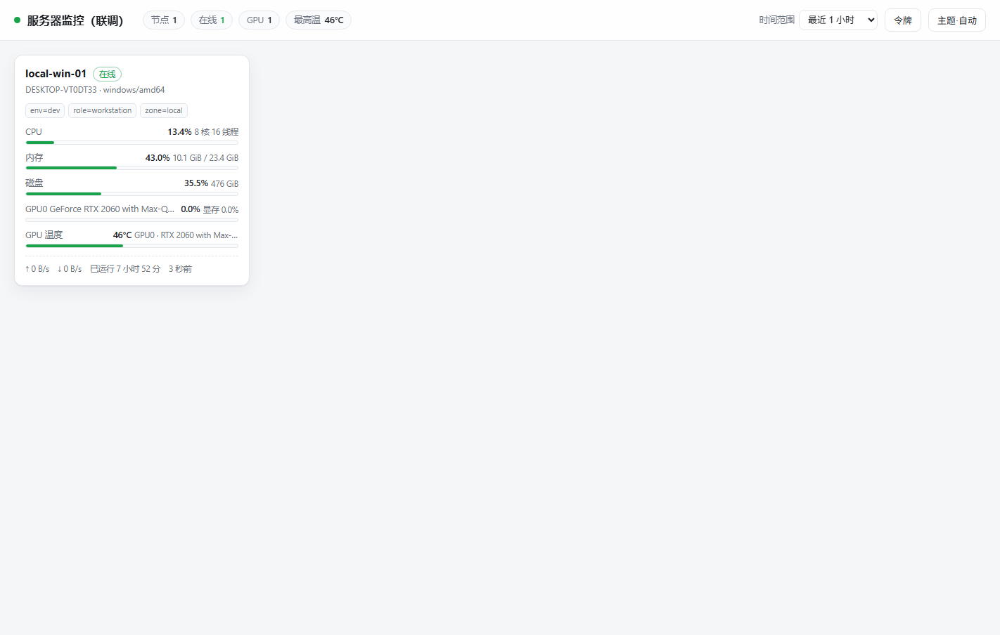
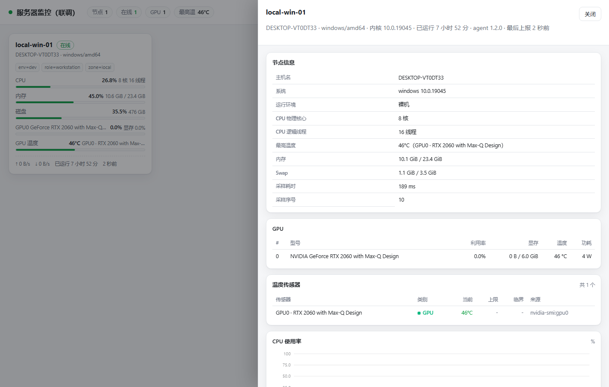
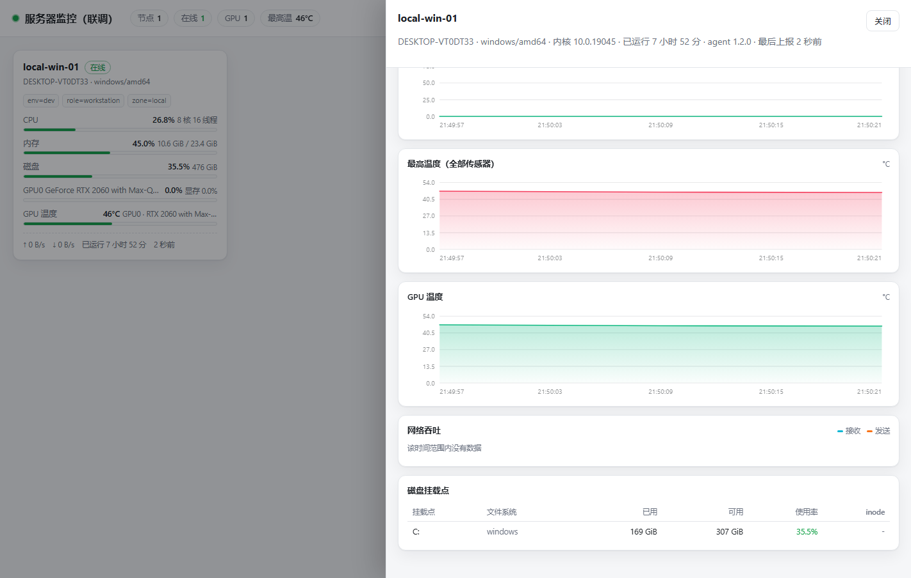

# 服务器监控 · mon-agent / mon-master

节点服务器定时把 CPU / 内存 / 磁盘 / 网络 / GPU / **温度** 指标上报给主控，主控存储并提供一个只读看板。

**一句话设计目标**：主控只接收数据，**在架构上不具备操作节点服务器的任何可能**。

| 指标 | 实测值 |
|---|---|
| agent 体积 | **6.23 MB**（linux/amd64，静态单文件，无任何运行时依赖） |
| master 体积 | **6.14 MB**（同上，已内嵌看板前端） |
| agent 常驻内存 | 约 **19 MB** |
| master 常驻内存 | 约 **15 MB**（10 个节点在线） |
| 单条样本 | 约 **1 KB**（含温度传感器列表，上限 32 个） |
| agent 采集耗时 | Linux 全开约 **20 ms**；调 nvidia-smi 约 **120 ms**；Windows 上再加温度采集约 **+25 ms**（探测 16 个磁盘设备） |
| 部署方式 | 复制一个文件 + 一份 JSON 配置 + 一个 systemd 单元 |

> 安全模型、威胁模型与"为什么主控做不到"的完整论证见 **[SECURITY.md](SECURITY.md)**。
> 温度的采集来源、平台差异与已知边界见 **[温度监控](#温度监控)**。

---

## 架构

```
   节点（多台）                                        主控（一台）
┌────────────────────────┐                    ┌──────────────────────────────┐
│  mon-agent             │  HTTPS POST        │  mon-master                  │
│  ─ 只读采集 /proc /sys │ ────────────────▶  │  ─ POST /api/v1/report       │
│  ─ 内存中缓冲断网数据   │  仅此一条通道       │  ─ 按天追加 JSONL（自动 gzip）│
│  ─ 无监听端口          │  ✗ 无反向通道 ✗    │  ─ 内嵌只读看板（无外部资源） │
└────────────────────────┘                    └──────────────────────────────┘
```

- **agent 不监听任何端口**，只做「采集 → POST → 丢弃响应」。
- **master 没有任何出站网络能力**，只能被动应答 HTTP 请求。
- 两者之间不存在命令通道、配置下发、心跳回执或自更新。

---

## 快速开始

### 1. 启动主控

```bash
# 生成令牌
REPORT_TOKEN=$(openssl rand -hex 24)

cat > master.json <<EOF
{
  "listen": "127.0.0.1:8080",
  "data_dir": "/var/lib/mon-master",
  "report_token": "$REPORT_TOKEN"
}
EOF

./mon-master-linux-amd64 -config master.json
# → mon-master 1.0.0 已启动，监听 127.0.0.1:8080
```

浏览器打开 <http://127.0.0.1:8080> 即可看到看板（没有数据时是空态页）。

主控默认**只监听回环地址**。要接收外网节点上报，请用 nginx/caddy 做 TLS 反代
（参考 `deploy/nginx.conf.example`），不要直接把 master 暴露出去。

### 2. 接入一个节点

```bash
cat > /etc/mon-agent/agent.json <<EOF
{
  "node_id": "web-01",
  "master_url": "https://monitor.example.com/api/v1/report",
  "token": "$REPORT_TOKEN",
  "interval_sec": 10
}
EOF
chmod 600 /etc/mon-agent/agent.json

# 先自检：验证采集、网络、鉴权全链路
sudo mon-agent -config /etc/mon-agent/agent.json -selftest
# → [agent web-01] 自检通过：已成功上报 1043 字节到 https://… （interval=10s）

sudo systemctl enable --now mon-agent
```

一键安装脚本（建专用用户、放二进制、写配置、装并启动服务、跑自检）：

```bash
# Linux + systemd
sudo MON_TOKEN=<上报令牌> sh deploy/install-agent.sh \
     --node-id web-01 \
     --master-url https://monitor.example.com/api/v1/report \
     --labels env=prod,zone=cn-hz-a,role=web

# 先预演一遍看它会做什么 —— 不需要 root，也不落盘
sh deploy/install-agent.sh --node-id web-01 --master-url https://monitor.example.com/api/v1/report --dry-run
```

```powershell
# Windows（管理员 PowerShell；计划任务以 SYSTEM 身份运行，磁盘温度这类要提权的采集项才读得到）
$env:MON_TOKEN = '<上报令牌>'
.\deploy\install-agent.ps1 -NodeId web-01 -MasterUrl https://monitor.example.com/api/v1/report
.\deploy\install-agent.ps1 -NodeId web-01 -MasterUrl https://… -WhatIf   # 预演，同样不需要管理员
```

主控侧从零到能上报的完整步骤见 [`docs/deploy-master.md`](docs/deploy-master.md)。

### 3. Docker 一把梭（本地体验）

```bash
MON_REPORT_TOKEN=$(openssl rand -hex 24) \
  docker compose -f deploy/docker-compose.yml up -d
# 打开 http://127.0.0.1:8080
```

compose 文件已经把宿主机的 `/sys` 以只读方式挂进了 agent 容器，
否则温度传感器（`/sys/class/hwmon`）在容器里看不到，温度列表会是空的。
自己写 compose 时同样需要这一条：`- /sys:/sys:ro`。

---

## 构建

需要 Go 1.21+（无任何第三方依赖，`GOPROXY=off` 也能构建）。

```bash
make            # 交叉编译 5 个平台到 dist/
make agent      # 只构建 agent
make master     # 只构建 master
make test       # 单元测试（温度解析、指标解析等）
make check      # go vet + 单元测试 + 安全审计 + 前端渲染冒烟（CI 必跑）
make upx        # 可选：用 upx 再压到约 2.4 MB
```

没有 `make` 的机器（比如 Git Bash）直接用脚本：

```bash
sh scripts/build.sh          # 等价于 make
sh scripts/check.sh          # 等价于 make check
sh scripts/security-audit.sh # 只跑安全审计
```

产物：

```
dist/mon-agent-linux-amd64      6.23 MB
dist/mon-agent-linux-arm64
dist/mon-agent-windows-amd64.exe
dist/mon-agent-darwin-amd64 / -arm64
dist/mon-master-<同上>           6.14 MB
dist/SHA256SUMS.txt
```

体积说明：`CGO_ENABLED=0` + `-trimpath -ldflags "-s -w"`，得到 6 MB 级的静态单文件。
其中约 2.5 MB 是 `crypto/tls` + `net/http`（HTTPS 上报必需）。加上完整的温度采集后
只增加了约 30 KB。如果需要更小，`make upx` 可以压到约 2.4 MB，
但部分安全软件会对 upx 壳误报，请自行权衡。

---

## agent 配置

`agent.json`（完整示例见 `agent/agent.example.json`）：

| 字段 | 默认 | 说明 |
|---|---|---|
| `node_id` | 必填 | 节点唯一名，`[A-Za-z0-9._-]`，1–64 字符。会作为主控侧的存储目录名 |
| `master_url` | 必填 | 上报地址，如 `https://mon.example.com/api/v1/report` |
| `token` | 必填 | 上报令牌，至少 12 字符 |
| `interval_sec` | 10 | 上报间隔（1–3600 秒） |
| `timeout_sec` | 8 | 单次上报超时 |
| `buffer_max` | 120 | 断网时内存中缓存的最大条数（**只在内存里**） |
| `labels` | — | 任意键值对，用于在看板上分组（如 `env`、`zone`、`role`） |
| `collect.*` | 全开 | 各指标开关：`cpu` `mem` `disk` `net` `gpu` `temp` |
| `collect.disk_mounts` | 自动 | 指定要监控的挂载点，留空则自动发现并跳过伪文件系统 |
| `collect.per_core` | false | 是否上报每核占用率（64 核机器上单条会多约 400 字节，画图不常用） |
| `collect.temp` | true | 采集所有能读到的温度传感器（CPU / 主板 / 硬盘 / 网卡 / GPU） |
| `collect.temp_limit` | 32 | 单条样本最多上报几个传感器，按 `CPU > GPU > 硬盘 > 主板 > 网卡 > 其他` 截断（上限 128） |
| `collect.temp_exclude` | 空 | 按子串排除传感器，匹配 `name` 或 `source`，例如 `["Composite"]` 去掉 NVMe 的复合温度 |
| `gpu.enabled` | true | 是否采集 GPU。设为 false 后进程完全不会调用任何外部命令 |
| `gpu.binary` | nvidia-smi | GPU 采集器路径 |
| `gpu.include_uuid` | false | 是否上报 GPU UUID |
| `tls.ca_file` | — | 自签证书场景指定 CA |
| `tls.cert_file`/`key_file` | — | 两者都填则启用 mTLS |
| `tls.insecure_skip_verify` | false | 仅联调用，启动时会打印告警 |

环境变量覆盖（优先级高于配置文件，适合 K8s Secret 注入）：
`MON_NODE_ID`、`MON_MASTER_URL`、`MON_TOKEN`、`MON_INTERVAL_SEC`、`MON_LABELS`（`k=v,k=v`）。

### 命令行

```bash
mon-agent -config agent.json            # 正式运行
mon-agent -config agent.json -once      # 采集一次并打印 JSON，不上报
mon-agent -config agent.json -dry-run   # 打印将要上报的内容与体积
mon-agent -config agent.json -selftest  # 真实上报一次，验证网络与鉴权
mon-agent -version
```

### 内置的安全护栏

- `master_url` 使用明文 `http://` 时**直接启动失败**，必须显式设 `MON_ALLOW_INSECURE_HTTP=1` 才放行。
- 配置文件权限过宽（非 600）时打印告警。
- 不跟随 HTTP 重定向（防止令牌与指标被重定向到第三方）。
- 启动时先做一次"预热采集"并丢弃，因此**第一个上报的样本就是准的**（不会出现首帧 CPU 0%）。

---

## master 配置

`master.json`（完整示例见 `master/master.example.json`）：

| 字段 | 默认 | 说明 |
|---|---|---|
| `listen` | 127.0.0.1:8080 | 监听地址 |
| `data_dir` | ./data | 数据目录 |
| `title` | 服务器监控 | 看板标题 |
| `report_token` | — | 全局上报令牌 |
| `node_tokens` | — | `{节点名: 令牌}`，**非空时以此为准**，实现一节点一令牌 |
| `admin_token` | — | 看板与查询接口的访问令牌 |
| `retention_days` | 30 | 数据保留天数 |
| `cache_per_node` | 1440 | 每节点在内存中缓存的最近条数（看板秒开） |
| `max_body_kb` | 256 | 单次上报请求体上限 |
| `rate_limit_per_sec` | 5 | 每 IP / 每节点限流 |
| `trust_proxy` | false | 部署在反代后面时置 true，否则限流会把所有节点算作反代 IP |

环境变量：`MON_MASTER_LISTEN`、`MON_MASTER_DATA_DIR`、`MON_MASTER_REPORT_TOKEN`、`MON_MASTER_ADMIN_TOKEN`。

### 启动时的强制校验

- `report_token` 与 `node_tokens` 至少配一个，否则拒绝启动（否则任何人都能写入）。
- **监听非回环地址但未设 `admin_token` 时拒绝启动** —— 这相当于把整个机房的资产画像公开。
  确需如此（比如已在反代做了 IP 白名单）时，用 `MON_MASTER_ALLOW_OPEN_READ=1` 显式确认。

### 看板

- 顶部：节点数 / 在线 / 离线 / GPU 数量 / **全场最高温**总览。
- 卡片：CPU、内存、磁盘、GPU 使用率条形图 + **各温度类别条形图** + 网络吞吐 + 负载 + 运行时长 + 上报延迟。
  任何传感器 ≥85℃ 会直接在卡片上弹出告警条，不用点进详情才发现。
- 点击卡片进入详情：CPU / 内存 / 磁盘 / GPU / **温度** 的历史曲线（可切 15 分钟 ~ 7 天），
  外加温度传感器全量明细、磁盘挂载点明细、GPU 明细、采集降级信息。
- 只读，没有任何能影响节点的按钮。
- 纯原生 JS + 内嵌 SVG 绘图，**不引用任何外部 CDN**，完全离线可用。
- 前端零依赖、零构建步骤，全部在 `master/web/` 下（HTML + CSS + JS 三个文件）。

配了 `admin_token` 时，点击右上角「令牌」填入即可（存在浏览器 localStorage，不发往任何第三方）。



详情抽屉（上：节点信息 / 温度传感器明细；下：各指标历史曲线）：





上面三张图由 `node scripts/screenshot.mjs <url> docs/screenshots` 生成——
它会自己拉起一个无头 Chrome、截完再清理，零依赖。
存在的意义是补上 `render-smoke.mjs` 覆盖不到的那一层：冒烟测试只能验证
"函数返回的 HTML 字符串对不对"，验证不了版式；而"温度行里的传感器名太长、
把整行挤成两行、带乱了整排卡片的对齐"这类问题只有真渲染一遍才看得见。

---

## HTTP API

| 方法 | 路径 | 鉴权 | 说明 |
|---|---|---|---|
| POST | `/api/v1/report` | 上报令牌 | 接收指标，唯一写入通道 |
| GET | `/api/v1/nodes` | admin_token | 全部节点最新状态 |
| GET | `/api/v1/history` | admin_token | 历史曲线 |
| GET | `/api/v1/meta` | 无 | 版本、保留期等元信息 |
| GET | `/healthz` | 无 | 存活探针 |

```bash
# 上报
curl -X POST https://mon.example.com/api/v1/report \
  -H "Authorization: Bearer $TOKEN" \
  -H "Content-Type: application/json" \
  --data-binary @sample.json

# 历史曲线：最近 6 小时的 CPU 使用率
curl -H "Authorization: Bearer $ADMIN_TOKEN" \
  "https://mon.example.com/api/v1/history?node=web-01&metric=cpu&minutes=360"
```

`/api/v1/history` 支持的 `metric`：

| metric | 单位 | 说明 |
|---|---|---|
| `cpu` / `mem` / `disk` | % | 使用率；`disk` 默认取最紧张的那个挂载点 |
| `load1` | — | 1 分钟负载 |
| `temp` | °C | **全部传感器里的最高温**（温度是"越高越坏"，所以一律取 max） |
| `temp:cpu` `temp:gpu` `temp:disk` `temp:board` `temp:nic` `temp:other` | °C | 指定类别的最高温 |
| `cpu_temp` / `gpu_temp` | °C | 兼容旧指标名 |
| `gpu` / `gpu_mem` / `gpu_power` | % / % / W | 多卡时取最大值；`gpu:1` 可指定第 N 块 |
| `net_rx` / `net_tx` | KiB/s | 吞吐 |
| `mem_used` / `disk_avail` | GiB | 绝对值（`disk_avail` 需带 `&mount=/data`） |

其他参数：`minutes`（默认 60，最大 14 天）、`step`（秒，默认自动，
让返回点数落在 300 左右）、`to`（结束时间戳）。

---

## 温度监控

温度被单独拎出来讲，是因为它是**唯一一个在所有平台上都读不全的指标**：
没有统一的系统调用，各家平台各有一套接口，能不能读到取决于芯片、驱动和权限。

### 数据模型

一次采样里的温度是一张**传感器列表**，而不是单个数字：

```json
{
  "temps": [
    {"name": "CPU · Package id 0", "kind": "cpu",  "source": "hwmon:coretemp/temp1",
     "temp_c": 58.0, "max_c": 84.0, "crit_c": 100.0},
    {"name": "硬盘 · Composite",   "kind": "disk", "source": "hwmon:nvme/temp1",
     "temp_c": 41.5, "max_c": 65.9, "crit_c": 85.3},
    {"name": "GPU0 · RTX 4090",    "kind": "gpu",  "source": "nvidia-smi:gpu0",
     "temp_c": 71.0}
  ],
  "max_temp_c": 58.0
}
```

- `kind` 固定为 `cpu` / `gpu` / `disk` / `board` / `nic` / `other` 之一，看板按它聚合与配色。
- `max_c` / `crit_c` 是芯片或固件给出的阈值，用来判断"离过热还有多远"，读不到时为 0。
- `max_temp_c` 是全部传感器的最高温，方便上层只用一个数就能做告警。
- `cpu.temp_c` 会从 `kind=cpu` 的传感器里回填，保持与旧版本字段兼容。

### 各平台能读到什么

| 平台 | CPU | 主板 | 硬盘 | 网卡 | GPU |
|---|---|---|---|---|---|
| **Linux** | ✅ hwmon / thermal_zone | ✅ hwmon | ✅ NVMe、drivetemp | ✅ mlx5、i40e 等 | ✅ nvidia-smi（AMD 走 hwmon） |
| **Windows** | ❌ | ❌ | ⚠️ 需管理员权限 | ❌ | ✅ nvidia-smi |
| **macOS** | ❌ | ❌ | ❌ | ❌ | ❌ |

- **Linux 是唯一完整支持的平台**，全部来自只读 sysfs，**不需要 root、不调用任何外部命令**：
  - `/sys/class/hwmon/hwmon*/tempN_input` 为主来源，芯片名映射到 `kind`（`coretemp`/`k10temp` → CPU，
    `nvme`/`drivetemp` → 硬盘，`amdgpu` → GPU，`nct6775`/`it87` 等 Super I/O → 主板，`mlx5`/`i40e` → 网卡）。
  - `/sys/class/thermal/thermal_zone*` 为补充来源，ARM 板卡（树莓派等）通常只有这个。
  - 去重策略：**hwmon 优先**，thermal 只补 hwmon 没覆盖到的类别。否则每台 x86 都会把
    `coretemp` 和 `thermal_zone` 的同一个 CPU 温度各报一遍。
  - 容器里需要 `--device`/`-v /sys:/sys:ro` 才能读到宿主机的 hwmon 目录，否则会收到一条
    `temp: 未在 /sys/class/{hwmon,thermal} 读到温度传感器` 的采集降级提示。
- **Windows 读不到 CPU 温度**是平台限制，不是实现遗漏：Windows 没有公开的、非管理员可用的
  CPU 温度 API，正规做法要么走 WMI（需要 COM/OLE 互操作），要么装内核驱动（如
  OpenHardwareMonitor），要么调用 `powershell Get-CimInstance`。
  这三条路都超出了本项目"零依赖、无外部命令、无额外攻击面"的约束——**宁可不报，也不为此放宽安全边界**。
  磁盘温度走 `IOCTL_STORAGE_QUERY_PROPERTY`，需要管理员权限，非管理员运行时静默跳过。
- **macOS** 没有不依赖 `powermetrics`（需 root）的读取途径，因此完全不采集温度；其他指标也尚未实现。

### 采样与上报

- 默认开启，可用 `collect.temp: false` 关闭。
- 单条样本上限 32 个传感器（`collect.temp_limit`），按
  `CPU > GPU > 硬盘 > 主板 > 网卡 > 其他` 的优先级截断——双路主板 + 12 盘位的机器
  一次能读出上百个传感器，全上报既没意义又会撑大存储。
- 读数 `<= 0` 或 `> 150` 一律丢弃：前者是"读不到"，后者基本是寄存器解析错误（部分主板返回 255）。
- 同一类别内按名称排序，保证同一台机器的传感器顺序在多次采样之间稳定，不会让曲线跳来跳去。
- 想排除单个传感器用 `collect.temp_exclude`，匹配 `name` 或 `source` 的子串，
  例如 `["Composite", "hwmon:nvme"]` 可以去掉 NVMe 的复合温度。
- 加温度几乎没有成本：**不新增任何外部命令调用**。agent 依然只有一处 `exec`（nvidia-smi），
  且参数向量写死——这一点由 `scripts/security-audit.sh` 每次提交强制校验。
  Linux 上读取全部来自几次 sysfs 小文件读，耗时低于 1 ms；Windows 上因为要逐个探测
  `\\.\PhysicalDrive0..15` 才会多出约 25 ms（占 10 秒上报间隔的 0.25%）。
  如果只想省掉这部分，`collect.temp: false` 即可。

---

## CPU 核心与线程

看板上的 CPU 一行显示成 **`8 核 16 线程`**，而不是笼统的「16 核」。

这两个是不同的量，混起来正好差一倍。`runtime.NumCPU()`、`/proc/stat` 里 `cpuN` 的行数、
`/proc/cpuinfo` 里 `processor` 的块数，返回的**全都是逻辑处理器数**——在开了超线程的
8 核机器上就会得出一个「16 核」。物理核心必须另外去问内核：

| 平台 | 物理核心 | 逻辑线程 | 插槽（路）数 |
|---|---|---|---|
| **Linux** | sysfs `cpuN/topology/` 下 `(physical_package_id, cluster_id, core_id)` 的唯一组合 | `/sys/devices/system/cpu/online` 的区间长度 | `physical_package_id` 的唯一值个数 |
| **Windows** | `GetLogicalProcessorInformationEx(RelationProcessorCore)` 的记录条数 | 各处理器组 `ActiveProcessorCount` 之和（兼容 >64 逻辑处理器） | `RelationProcessorPackage` 的记录条数 |

上报字段：

```json
{ "cpu": { "usage_pct": 42.5, "cores": 8, "threads": 16, "sockets": 1 } }
```

- `cores` 是**物理核心**数，`threads` 是**逻辑处理器**数。两者相等即说明没有超线程。
- `sockets` 是物理插槽数，用来区分「8 核」是 1 路 ×8 还是 2 路 ×4；
  看板上**只有 ≥2 路才会显示这一行**——单路是绝大多数情况，多路才是需要一眼看出的信息。
- **识别不出物理核心时 `cores` 为 0，看板只显示 `16 线程`**，绝不拿线程数冒充核心数：
  报一个"看起来很正常的错数"比报"不知道"危害更大。
- Linux 上按 `sysfs topology` → `/proc/cpuinfo`（`physical id` + `core id`）→ `/proc/stat` 行数
  依次降级，三者都拿不到物理核心就如实留空。全程只读文件，**不调用任何外部命令、不需要 root**。
  `core_id` 只在同一个簇内唯一，因此 ARM 上把 `cluster_id` 一并算进键，否则大小核簇的核心 0 会被并成一个。
- Windows 侧只调用 kernel32 的只读查询 API，同样不 exec、不写文件、不开端口。

---

## 存储与容量

数据按 `data_dir/<node_id>/YYYY-MM-DD.jsonl` 追加写入，**每分钟维护任务**会把非当天的文件
压缩成 `.jsonl.gz`（约 1/10），并清理超过 `retention_days` 的文件。

单节点容量估算（`interval_sec=10`，约 1.5 KB/条含网络与 GPU）：

| 周期 | 未压缩 | 压缩后 |
|---|---|---|
| 1 天 | ≈ 13 MB | ≈ 1.5 MB |
| 30 天 | ≈ 390 MB | ≈ 45 MB |

100 个节点跑 30 天大约 4.5 GB —— 单机文件存储足够，不需要引入时序数据库。
故障排查也很直接：`jq -c 'select(.ts > 1234567890)' 2026-09-11.jsonl`。

---

## 部署形态

| 场景 | 方式 |
|---|---|
| 物理机 / 虚拟机（Linux） | `deploy/install-agent.sh` + `deploy/mon-agent.service`（已做完整 systemd 加固） |
| 物理机 / 虚拟机（Windows） | `deploy/install-agent.ps1`（写配置、收紧 ACL、注册以 SYSTEM 身份运行的计划任务） |
| 容器 | `deploy/Dockerfile.agent`、`deploy/docker-compose.yml` |
| 主控 | `deploy/mon-master.service` 或 `deploy/Dockerfile.master`（scratch 镜像）；部署步骤见 [`docs/deploy-master.md`](docs/deploy-master.md) |
| 反向代理 | `deploy/nginx.conf.example`（TLS + 限流 + 请求体上限 + 可选 IP 白名单） |

内置 systemd 单元的加固项包括：`ProtectSystem=strict`（**整个文件系统只读** —— 因为 agent
运行期压根不写文件）、`CapabilityBoundingSet=` 为空、`SystemCallFilter=@system-service`、
`RestrictAddressFamilies`、`MemoryMax=256M`、`CPUQuota=20%`、专用非登录用户。

Windows 节点用 `install-agent.ps1` 装完后，CPU（含物理核心/线程数）、内存、磁盘、GPU
指标均已支持；网络吞吐与 CPU 温度暂未实现。脚本的两个权限判定值得留意：**写
`%ProgramFiles%` / `%ProgramData%` 才需要管理员**，因此把配置与安装目录指向用户可写位置时
不必提权；而**注册以 SYSTEM 身份运行的计划任务**必须管理员（可用 `-NoTask` 改用你熟悉的
守护方式）。`-WhatIf` 全程不需要管理员，且会真实走完参数校验与配置渲染，只不落盘。

---

## 故障排查

| 现象 | 原因与处理 |
|---|---|
| agent 启动报"明文 http 会泄露上报令牌" | 预期行为。换 https，或确认内网可信后设 `MON_ALLOW_INSECURE_HTTP=1` |
| agent 报"上报失败（本地已缓存 N 条）" | 网络或主控不可达。agent 会自动按序补发，不会丢数据（内存上限内） |
| 看板空白 / 401 | 主控配了 `admin_token`，点右上角「令牌」填入 |
| 节点显示"离线" | 超过 `3 × interval_sec` 没上报。看 agent 的 `journalctl -u mon-agent -f` |
| 卡片显示"采集降级：net: Windows 平台暂未实现…" | Windows 节点的已知限制，不影响其他指标 |
| 看板上没有任何温度 | 按平台判断：Linux 上多半是容器没挂 `/sys`（加 `-v /sys:/sys:ro`）；Windows 上只有 GPU 温度可读，属预期。用 `-once` 看 `temps` 字段确认 |
| 温度列表只有 GPU，没有硬盘 | Windows 读磁盘温度需要管理员权限，非管理员运行时静默跳过 |
| 温度传感器太多，样本变大 | 调小 `collect.temp_limit`，或用 `collect.temp_exclude` 按名称排除（如 `["Composite"]` 去掉 NVMe 复合温度） |
| Windows 下 agent 的中文提示是乱码 | PowerShell 按系统 ANSI 码页（中文 Windows 是 GBK）解码原生命令输出，而 agent 写的是 UTF-8。先执行 `[Console]::OutputEncoding = [Text.Encoding]::UTF8`（或 `chcp 65001`）再看；`install-agent.ps1` 的自检已经替你做了这层转换 |
| 主控启动报"监听地址不是回环地址，但未设置 admin_token" | 安全兜底。设 `admin_token`，或确认风险后设 `MON_MASTER_ALLOW_OPEN_READ=1` |
| 看板不刷新 | 前端每 5 秒拉一次、图表每 15 秒重绘一次；确认浏览器没装拦截扩展 |

自检顺序建议：`-once`（采集）→ `-dry-run`（序列化）→ `-selftest`（网络 + 鉴权）→ 看板。

---

## 项目结构

```
server-monitor/
├── agent/                    # 节点采集端
│   ├── main.go               # 主循环、内存缓冲、优雅退出
│   ├── config.go             # 配置加载、校验与安全护栏
│   ├── collect.go            # 采集调度、温度合并/过滤/排序
│   ├── sysfs.go              # sysfs/procfs 公共读取设施（可注入根路径）
│   ├── tempsysfs.go          # sysfs 温度解析（故意不加 build tag，见下）
│   ├── cputopo.go            # CPU 物理核/线程/插槽解析（同样不加 build tag）
│   ├── cputopo_windows.go    # Windows 侧走 GetLogicalProcessorInformationEx
│   ├── collect_linux.go      # /proc /sys 采集器（功能最完整）
│   ├── collect_windows.go    # kernel32 + ntdll 只读 API 采集器
│   ├── collect_other.go      # 其他平台的基础存活上报
│   ├── gpu.go                # nvidia-smi 固定参数调用（唯一的 exec）
│   ├── sender.go             # 唯一的出站通道
│   ├── types.go              # 上报数据结构
│   ├── tempsysfs_test.go     # 温度解析测试（用假 sysfs 树，任意平台可跑）
│   ├── cputopo_test.go       # CPU 拓扑解析测试（同上）
│   ├── collect_test.go       # 温度过滤/排序/去重测试
│   └── cputopo_windows_test.go # 真机上核对 NumCPU 与物理核不一致（仅 Windows 跑）
├── master/                   # 主控
│   ├── main.go               # HTTP 服务、优雅关闭、维护任务
│   ├── api.go                # 上报接收 + 只读查询 + 降采样 + 温度指标解析
│   ├── store.go              # JSONL 存储、内存缓存、gzip 归档、保留期清理
│   ├── config.go             # 配置与启动期强制校验
│   ├── ratelimit.go          # 令牌桶限流
│   ├── api_test.go           # 温度指标解析与聚合测试
│   └── web/                  # 内嵌看板（HTML/CSS/JS，零依赖零构建）
├── deploy/                   # systemd / Docker / nginx / 一键安装脚本（install-agent.sh · install-agent.ps1）
├── docs/
│   ├── deploy-master.md      # 主控部署教程（从空机器到看板可用）
│   └── screenshots/          # README 里引用的看板截图（由脚本生成）
├── scripts/security-audit.sh # 结构性安全约束的自动化审计
├── scripts/check-ps1.ps1     # PowerShell 脚本的 BOM 与语法检查（中文脚本没 BOM 会变乱码）
├── scripts/render-smoke.mjs  # 看板渲染冒烟测试（DOM 桩，验证函数输出）
├── scripts/screenshot.mjs    # 看板截图（真渲染，验证版式）
├── SECURITY.md               # 安全模型与威胁模型
└── Makefile
```

> `sysfs.go` / `tempsysfs.go` / `cputopo.go` 为什么共享文件名前缀且都不加 `//go:build linux`：
> 它们都是"在一棵目录树上按约定文件名读文本"的纯逻辑，与操作系统无关，只有挂载前缀不同
> （`sysRoot` 是个变量，测试把它指到临时目录）。如果放进带 linux tag 的文件里，
> 这套最易写错、又最难在真实硬件上复现的解析规则就永远无法被测试——而 CI 和大多数开发机是 Windows/macOS。
> 在非 Linux 平台上它们不会被任何代码引用，会被链接器整体丢弃，不进二进制。

---

## 安全

完整的论证在 **[SECURITY.md](SECURITY.md)**。核心是八条可验证的结构性保证：
agent 不监听端口、不注册处理器、不解析响应、不写文件、不执行外部命令（GPU 采集的固定参数除外）、
不跟随重定向；master 没有任何出站网络能力、不执行任何外部命令。

这些保证由 `make check` 中的 18 项静态断言强制执行 —— 不是文档里的承诺，而是会让 CI 失败的检查：

```bash
$ make check
==> go vet
==> 单元测试
ok  	monagent
ok  	monmaster
==> 安全审计
  [通过] agent 不得监听任何端口（否则主控就有了连入点）
  [通过] master 不得主动发起任何网络连接（只能被动应答）
  ...
结论：全部通过 —— 主控在架构上不具备操作节点服务器的手段。
==> 看板渲染冒烟
结论：全部通过。
```

审计只扫描**会进二进制的源码**，`*_test.go` 被显式排除：
测试代码不参与 `go build`，所以它写临时文件不构成对"agent 不写文件"的破坏；
反过来，"必须存在"的防线也不能被测试文件里的字符串满足，否则一句注释就能骗过审计。

---

## License

MIT
